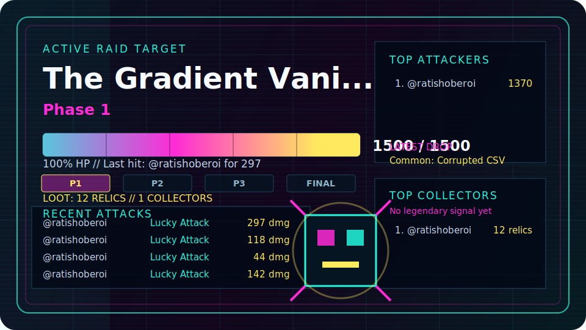

# ⚠ GLOBAL RAID ACTIVE

## THE GPU DEVOURER

**HP: 12%**

[**⚔ ATTACK THIS BOSS**](https://github.com/ratishoberoi/github-boss-raid-dev/issues/new?template=attack.yml)

Takes 10 seconds.  
Opens a GitHub attack form.  
Bot calculates damage.  
Loot is rolled automatically.  
Your result is posted and the issue auto-closes.

| Live Signal | Status |
| --- | --- |
| Last Attack | ⚠ No one has attacked yet. Become the First Raider. |
| Latest Loot | No relics discovered. The vault awaits. |
| Top Raider | ⚠ No one has attacked yet. Become the First Raider. |
| Boss Killer | No boss has fallen yet. |

## Current Record Holders

| Record | Holder |
| --- | --- |
| Most Damage | No raiders yet |
| Most Loot | No collectors yet |
| Most Executions | No executions yet |

  

  

## Current Boss

| Boss | HP | HP Bar | Phase | Last Attacker |
| --- | ---: | --- | --- | --- |
| The GPU Devourer | 120 / 1000 (12%) | `███░░░░░░░░░░░░░░░░░░░░░` | Phase 3 | None yet |

## 👑 Latest Executioner

No executioner yet. Land the final blow to claim the first crown.

## Current Boss Lore

**Infinite Compute Maw**  
A furnace-beast that eats compute clusters and exhales molten tensors.

| Signal | Value |
| --- | --- |
| Theme | Machine consuming infinite compute |
| Threat Level | SEVERE |
| Corruption Level | 88% |
| Danger Meter | `█████████████████████░░░` |

## Boss Evolution Status

| Phase | Form | Status |
| --- | --- | --- |
| Phase 1 | Normal form: a plated machine with a restrained thermal core. | Cleared |
| Phase 2 | Mutated form: cooling towers snap open into claws and intake fans become teeth. | Cleared |
| Phase 3 | Corrupted form: molten cache spills from its chassis and burns the grid. | ACTIVE |
| Phase 4 | Final Nightmare form: a starved compute singularity with an endless reactor mouth. | Dormant |

## Phase Description

Corrupted form: molten cache spills from its chassis and burns the grid.

## Raid Terminal

| Signal | Value |
| --- | --- |
| Status | ACTIVE RAID TARGET |
| Integrity | 12% |
| Phase Window | Phase 3 |
| Boss Image | `assets/bosses/gpu_devourer_p3.svg` |
| Attack Vector | GitHub attack form |

## Attack

[Attack This Boss](https://github.com/ratishoberoi/github-boss-raid-dev/issues/new?template=attack.yml)

Roll damage and claim loot:

| Attack | Damage |
| --- | ---: |
| Slash | 5-20 |
| Critical Strike | 0-100 |
| Lucky Attack | 1-500 |

## Top 10 Attackers

| Rank | Attacker | Total Damage | Attacks |
| ---: | --- | ---: | ---: |
| - | No attackers yet | 0 | 0 |

## Last 10 Attacks

| Time | Attacker | Attack | Damage | Result |
| --- | --- | --- | ---: | --- |
| - | No attacks yet | - | - | - |

## Hall of Relics

| Relic Signal | Value |
| --- | ---: |
| Total Relics Held | 0 |
| Active Collectors | 0 |
| Legendary Discoveries | 0 |
| Mythic Discoveries | 0 |

| Rarity | Drop Rate | Owned | Registry Items |
| --- | ---: | ---: | ---: |
| Common | 80% | 0 | 4 |
| Rare | 15% | 0 | 4 |
| Epic | 4% | 0 | 4 |
| Legendary | 0.9% | 0 | 4 |
| Mythic | 0.1% | 0 | 3 |

## Latest Drops

No loot discovered yet.

## Legendary Discoveries

No legendary relics discovered yet.

## Mythic Discoveries

No mythic relics discovered yet.

## Top Collectors

| Rank | Collector | Total Relics | Unique | Legendary | Mythic |
| ---: | --- | ---: | ---: | ---: | ---: |
| - | No collectors yet | 0 | 0 | 0 | 0 |

## Recent Loot

| Time | Collector | Drop | Rarity | Damage |
| --- | --- | --- | --- | ---: |
| - | No loot yet | - | - | - |

## 👑 Executioner Hall

| Boss | Executioner | Badge | Final Blow | Date |
| --- | --- | --- | ---: | --- |
| No executions yet | - | - | - | - |

## Top Executioners

| Executioner | Execution Count | First Execution | Latest Execution |
| --- | ---: | --- | --- |
| No executions yet | 0 | - | - |

## Hall of Fame

No bosses defeated yet.

<!-- This README is generated by scripts/render_readme.js. -->
