  

# ⚠ GLOBAL RAID ACTIVE

## THE GPU DEVOURER

### Infinite Compute Maw

**HP 8 / 1000 (1%)**  
`░░░░░░░░░░░░░░░░░░░░░░░░`

**Final Phase of 4**  
Final Nightmare form: a starved compute singularity with an endless reactor mouth.

## [⚔ ATTACK THIS BOSS](https://github.com/ratishoberoi/github-boss-raid-dev/issues/new?template=attack.yml)

Takes 10 seconds. Roll damage. Claim loot. Maybe land the killing blow.

## Live Raid Pulse

**Last Attack:** @ratishoberoi hit for 32  
**Latest Loot:** @ratishoberoi found Lost Token (Common)  
**Top Raider:** @ratishoberoi with 112 damage  
**Boss Killer:** No boss has fallen yet.

## Phase Evolution

<table>
  <tr>
    <td align="center" width="25%">
      
       <strong>✅ CLEARED</strong> 
      Phase 1
    </td>
    <td align="center" width="25%">
      
       <strong>✅ CLEARED</strong> 
      Phase 2
    </td>
    <td align="center" width="25%">
      
       <strong>✅ CLEARED</strong> 
      Phase 3
    </td>
    <td align="center" width="25%">
      
       <strong>🔥 CURRENT</strong> 
      Phase 4
    </td>
  </tr>
</table>

**✅ Phase 1 → ✅ Phase 2 → ✅ Phase 3 → 🔥 Phase 4**  
Current transformation: Final Nightmare form: a starved compute singularity with an endless reactor mouth.  
Phases remaining: **0**

## WORLD BOSS CAMPAIGN

**🔥 CURRENT**  
Boss 1: The GPU Devourer

**🔒 LOCKED**  
Boss 2: The Data Leak Hydra

**🔒 LOCKED**  
Boss 3: The Gradient Vanisher

**🔒 LOCKED**  
Boss 4: The Hallucination Titan

**🔒 LOCKED**  
Boss 5: The Overfitted Beast

**🔒 LOCKED**  
Boss 6: The Prompt Goblin

## Current Record Holders

**Most Damage:** @ratishoberoi (112)  
**Most Loot:** @ratishoberoi (4)  
**Most Executions:** No executions yet

## 👑 Latest Executioner

No executioner yet. Land the final blow to claim the first crown.

## Why Attack Now

A furnace-beast that eats compute clusters and exhales molten tensors.

**Damage the boss. Roll loot. Push the next phase. Take the final blow.**

## Loot Signal

**Latest Drop:** @ratishoberoi found Lost Token (Common)  
**Vault:** 4 relics held by 1 collectors  
**Rare History:** 0 Legendary / 0 Mythic  
**Top Collector:** @ratishoberoi (4 relics)

Recent Combat

## Last 10 Attacks

| Time | Attacker | Attack | Damage | Result |
| --- | --- | --- | ---: | --- |
| 2026-05-25T07:25:20.156Z | @ratishoberoi | Lucky Attack | 32 | Final Phase |
| 2026-05-25T06:14:19.846Z | @ratishoberoi | Critical Strike | 54 | Final Phase |
| 2026-05-25T06:10:41.242Z | @ratishoberoi | Slash | 18 | Final Phase |
| 2026-05-25T05:30:31.086Z | @ratishoberoi | Slash | 8 | Phase 3 |

## Top 10 Attackers

| Rank | Attacker | Total Damage | Attacks |
| ---: | --- | ---: | ---: |
| 1 | @ratishoberoi | 112 | 4 |

Loot Vault

## Hall of Relics

| Relic Signal | Value |
| --- | ---: |
| Total Relics Held | 4 |
| Active Collectors | 1 |
| Legendary Discoveries | 0 |
| Mythic Discoveries | 0 |

| Rarity | Drop Rate | Owned | Registry Items |
| --- | ---: | ---: | ---: |
| Common | 80% | 2 | 4 |
| Rare | 15% | 2 | 4 |
| Epic | 4% | 0 | 4 |
| Legendary | 0.9% | 0 | 4 |
| Mythic | 0.1% | 0 | 3 |

## Latest Drops

| Time | Collector | Relic | Rarity |
| --- | --- | --- | --- |
| 2026-05-25T07:25:20.156Z | @ratishoberoi | Lost Token | Common |
| 2026-05-25T06:14:19.846Z | @ratishoberoi | Prompt Shard | Rare |
| 2026-05-25T06:10:41.242Z | @ratishoberoi | Corrupted CSV | Common |
| 2026-05-25T05:30:31.086Z | @ratishoberoi | Neural Fragment | Rare |

## Legendary Discoveries

No legendary relics discovered yet.

## Mythic Discoveries

No mythic relics discovered yet.

## Top Collectors

| Rank | Collector | Total Relics | Unique | Legendary | Mythic |
| ---: | --- | ---: | ---: | ---: | ---: |
| 1 | @ratishoberoi | 4 | 4 | 0 | 0 |

## Recent Loot

| Time | Collector | Drop | Rarity | Damage |
| --- | --- | --- | --- | ---: |
| 2026-05-25T07:25:20.156Z | @ratishoberoi | Lost Token | Common | 32 |
| 2026-05-25T06:14:19.846Z | @ratishoberoi | Prompt Shard | Rare | 54 |
| 2026-05-25T06:10:41.242Z | @ratishoberoi | Corrupted CSV | Common | 18 |
| 2026-05-25T05:30:31.086Z | @ratishoberoi | Neural Fragment | Rare | 8 |

Executioner Archives

## 👑 Executioner Hall

| Boss | Executioner | Badge | Final Blow | Date |
| --- | --- | --- | ---: | --- |
| No executions yet | - | - | - | - |

## Top Executioners

| Executioner | Execution Count | First Execution | Latest Execution |
| --- | ---: | --- | --- |
| No executions yet | 0 | - | - |

## Hall of Fame

No bosses defeated yet.

Raid Rules

## Attack Damage

| Attack | Damage |
| --- | ---: |
| Slash | 5-20 |
| Critical Strike | 0-100 |
| Lucky Attack | 1-500 |

## Drop Rates

| Rarity | Drop Rate | Owned | Registry Items |
| --- | ---: | ---: | ---: |
| Common | 80% | 2 | 4 |
| Rare | 15% | 2 | 4 |
| Epic | 4% | 0 | 4 |
| Legendary | 0.9% | 0 | 4 |
| Mythic | 0.1% | 0 | 3 |

## Implementation

This raid runs entirely inside GitHub using the profile README, Issues, Actions, JSON state, and generated SVGs.

<!-- This README is generated by scripts/render_readme.js. -->
