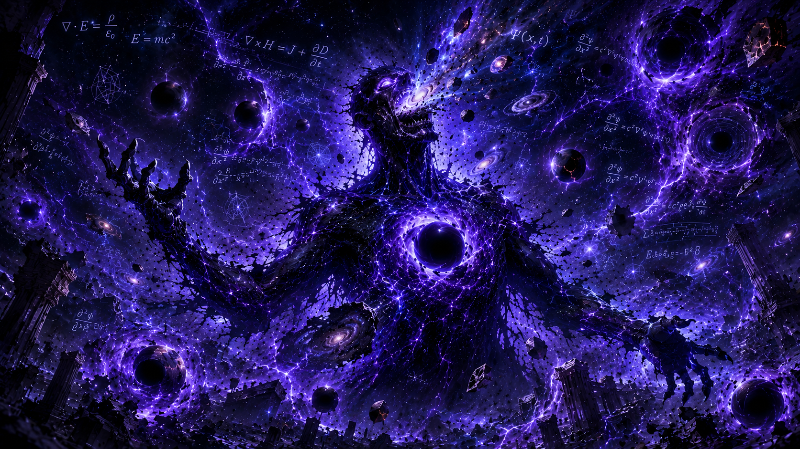

  

# ⚠ GLOBAL RAID ACTIVE

## THE GRADIENT VANISHER

### Fading Backprop Phantom

**HP 1500 / 1500 (100%)**  
`████████████████████████`

**Phase 1 of 4**  
Normal form: a sharp silhouette traced by clean vector lines.

  <strong>⬇⬇⬇ RAIDERS, STRIKE NOW ⬇⬇⬇</strong>

<h1 align="center">
  <a href="https://github.com/ratishoberoi/github-boss-raid-dev/issues/new?template=attack.yml">⚔ ATTACK THIS BOSS ⚔</a>
</h1>

  <strong>⬆⬆⬆ CLICK TO ROLL DAMAGE + CLAIM LOOT ⬆⬆⬆</strong>

Takes 10 seconds. Roll damage. Claim loot. Maybe land the killing blow.

## Raid Rules

### Attack Damage

| Attack | Damage |
| --- | ---: |
| Slash | 5-20 |
| Critical Strike | 0-100 |
| Lucky Attack | 1-500 |

### Drop Rates

| Rarity | Drop Rate | Owned | Registry Items |
| --- | ---: | ---: | ---: |
| Common | 80% | 6 | 4 |
| Rare | 15% | 6 | 4 |
| Epic | 4% | 0 | 4 |
| Legendary | 0.9% | 0 | 4 |
| Mythic | 0.1% | 0 | 3 |

Every attack is processed by GitHub Actions. Damage is applied to the shared boss, loot rolls automatically, the README updates, and the attack issue closes with the result.

## 🏆 TOP RAIDERS

> ### 🥇 #1 Raider
> **@ratishoberoi**
>
> **Total Damage:** 1370  
> **Attacks:** 12

> ### 🥈 #2 Raider
> **Open Slot**
>
> **Total Damage:** 0  
> **Attacks:** 0

> ### 🥉 #3 Raider
> **Open Slot**
>
> **Total Damage:** 0  
> **Attacks:** 0

### Top 10 Attackers

| Rank | Attacker | Total Damage | Attacks |
| ---: | --- | ---: | ---: |
| 1 | @ratishoberoi | 1370 | 12 |

### Current Record Holders

**Most Damage:** @ratishoberoi (1370)  
**Most Loot:** @ratishoberoi (12)  
**Most Executions:** @ratishoberoi (2)

## ⚔ RECENT COMBAT

### Last 10 Attacks

| Time | Attacker | Attack | Damage | Result |
| --- | --- | --- | ---: | --- |
| 2026-05-25T14:04:06.805Z | @ratishoberoi | Lucky Attack | 297 | Defeated boss |
| 2026-05-25T14:03:37.524Z | @ratishoberoi | Lucky Attack | 118 | Phase 3 |
| 2026-05-25T14:03:11.476Z | @ratishoberoi | Lucky Attack | 44 | Phase 3 |
| 2026-05-25T14:02:47.985Z | @ratishoberoi | Lucky Attack | 142 | Phase 3 |
| 2026-05-25T14:02:23.654Z | @ratishoberoi | Lucky Attack | 397 | Phase 3 |
| 2026-05-25T14:01:55.675Z | @ratishoberoi | Lucky Attack | 94 | Phase 2 |
| 2026-05-25T14:00:19.663Z | @ratishoberoi | Lucky Attack | 322 | Phase 1 |
| 2026-05-25T07:25:41.744Z | @ratishoberoi | Lucky Attack | 441 | Defeated boss |
| 2026-05-25T07:25:20.156Z | @ratishoberoi | Lucky Attack | 32 | Final Phase |
| 2026-05-25T06:14:19.846Z | @ratishoberoi | Critical Strike | 54 | Final Phase |

## Live Pulse

**Last Attack:** @ratishoberoi hit for 297  
**Latest Loot:** @ratishoberoi found Corrupted CSV (Common)  
**Top Raider:** @ratishoberoi with 1370 damage  
**Boss Killer:** @ratishoberoi (Hydra Hunter)

## 👑 Latest Executioner

  

## Phase Evolution

<table>
  <tr>
    <td align="center" width="25%">
      
       <strong>🔥 CURRENT</strong> 
      Phase 1
    </td>
    <td align="center" width="25%">
      
       <strong>🔒 LOCKED</strong> 
      Phase 2
    </td>
    <td align="center" width="25%">
      
       <strong>🔒 LOCKED</strong> 
      Phase 3
    </td>
    <td align="center" width="25%">
      
       <strong>🔒 LOCKED</strong> 
      Phase 4
    </td>
  </tr>
</table>

**🔥 Phase 1 → 🔒 Phase 2 → 🔒 Phase 3 → 🔒 Phase 4**  
Current transformation: Normal form: a sharp silhouette traced by clean vector lines.  
Phases remaining: **3**

## WORLD BOSS CAMPAIGN

<table>
  <tr>
    <td align="center" width="50%">
      
       <strong>☠ EXECUTED</strong> 
      <strong>Boss 1: The GPU Devourer</strong> Executed by: @ratishoberoi Badge: GPU Slayer 2026-05-25T07:25:41.744Z
    </td>
    <td align="center" width="50%">
      
       <strong>☠ EXECUTED</strong> 
      <strong>Boss 2: The Data Leak Hydra</strong> Executed by: @ratishoberoi Badge: Hydra Hunter 2026-05-25T14:04:06.805Z
    </td>
  </tr>
  <tr>
    <td align="center" width="50%">
      
       <strong>⚔ CURRENT</strong> 
      <strong>Boss 3: The Gradient Vanisher</strong> HP 1500 / 1500 Phase 1
    </td>
    <td align="center" width="50%">
      
       <strong>🔒 LOCKED</strong> 
      <strong>Boss 4: The Hallucination Titan</strong> LOCKED
    </td>
  </tr>
  <tr>
    <td align="center" width="50%">
      
       <strong>🔒 LOCKED</strong> 
      <strong>Boss 5: The Overfitted Beast</strong> LOCKED
    </td>
    <td align="center" width="50%">
      
       <strong>🔒 LOCKED</strong> 
      <strong>Boss 6: The Prompt Goblin</strong> LOCKED
    </td>
  </tr>
</table>

## NEXT THREAT

<table>
  <tr>
    <td align="center" width="45%">
      
    </td>
    <td width="55%">
      <strong>The Hallucination Titan</strong> 
      A towering oracle that speaks in impossible outputs and bends reality around false predictions.  
      <strong>Unlock Requirement:</strong> Execute The Gradient Vanisher.
    </td>
  </tr>
</table>

## Loot

**Latest Drop:** @ratishoberoi found Corrupted CSV (Common)  
**Vault:** 12 relics held by 1 collectors  
**Rare History:** 0 Legendary / 0 Mythic  
**Top Collector:** @ratishoberoi (12 relics)

Loot Vault

## Hall of Relics

| Relic Signal | Value |
| --- | ---: |
| Total Relics Held | 12 |
| Active Collectors | 1 |
| Legendary Discoveries | 0 |
| Mythic Discoveries | 0 |

| Rarity | Drop Rate | Owned | Registry Items |
| --- | ---: | ---: | ---: |
| Common | 80% | 6 | 4 |
| Rare | 15% | 6 | 4 |
| Epic | 4% | 0 | 4 |
| Legendary | 0.9% | 0 | 4 |
| Mythic | 0.1% | 0 | 3 |

## Latest Drops

| Time | Collector | Relic | Rarity |
| --- | --- | --- | --- |
| 2026-05-25T14:04:06.805Z | @ratishoberoi | Corrupted CSV | Common |
| 2026-05-25T14:03:37.524Z | @ratishoberoi | Corrupted CSV | Common |
| 2026-05-25T14:03:11.476Z | @ratishoberoi | Broken Dataset | Common |
| 2026-05-25T14:02:47.985Z | @ratishoberoi | Prompt Shard | Rare |
| 2026-05-25T14:02:23.654Z | @ratishoberoi | Memory Fragment | Common |
| 2026-05-25T14:01:55.675Z | @ratishoberoi | Gradient Crystal | Rare |
| 2026-05-25T14:00:19.663Z | @ratishoberoi | Gradient Crystal | Rare |
| 2026-05-25T07:25:41.744Z | @ratishoberoi | Gradient Crystal | Rare |
| 2026-05-25T07:25:20.156Z | @ratishoberoi | Lost Token | Common |
| 2026-05-25T06:14:19.846Z | @ratishoberoi | Prompt Shard | Rare |

## Legendary Discoveries

No legendary relics discovered yet.

## Mythic Discoveries

No mythic relics discovered yet.

## Top Collectors

| Rank | Collector | Total Relics | Unique | Legendary | Mythic |
| ---: | --- | ---: | ---: | ---: | ---: |
| 1 | @ratishoberoi | 12 | 7 | 0 | 0 |

## Recent Loot

| Time | Collector | Drop | Rarity | Damage |
| --- | --- | --- | --- | ---: |
| 2026-05-25T14:04:06.805Z | @ratishoberoi | Corrupted CSV | Common | 297 |
| 2026-05-25T14:03:37.524Z | @ratishoberoi | Corrupted CSV | Common | 118 |
| 2026-05-25T14:03:11.476Z | @ratishoberoi | Broken Dataset | Common | 44 |
| 2026-05-25T14:02:47.985Z | @ratishoberoi | Prompt Shard | Rare | 142 |
| 2026-05-25T14:02:23.654Z | @ratishoberoi | Memory Fragment | Common | 397 |
| 2026-05-25T14:01:55.675Z | @ratishoberoi | Gradient Crystal | Rare | 94 |
| 2026-05-25T14:00:19.663Z | @ratishoberoi | Gradient Crystal | Rare | 322 |
| 2026-05-25T07:25:41.744Z | @ratishoberoi | Gradient Crystal | Rare | 441 |
| 2026-05-25T07:25:20.156Z | @ratishoberoi | Lost Token | Common | 32 |
| 2026-05-25T06:14:19.846Z | @ratishoberoi | Prompt Shard | Rare | 54 |

## Executioners

Executioner Records

## 👑 Executioner Hall

| Boss | Executioner | Badge | Final Blow | Date |
| --- | --- | --- | ---: | --- |
| The Data Leak Hydra | @ratishoberoi (Hydra Hunter) | Hydra Hunter | 297 | 2026-05-25T14:04:06.805Z |
| The GPU Devourer | @ratishoberoi (GPU Slayer) | GPU Slayer | 441 | 2026-05-25T07:25:41.744Z |

## Top Executioners

| Executioner | Execution Count | First Execution | Latest Execution |
| --- | ---: | --- | --- |
| @ratishoberoi | 2 | 2026-05-25T07:25:41.744Z | 2026-05-25T14:04:06.805Z |

## Hall of Fame

Defeated Bosses

### Cinematic Defeat Archive

<table>
  <tr>
    <td align="center" width="55%">
      
    </td>
    <td width="45%">
      <h3>The Data Leak Hydra</h3>
      <strong>Executioner:</strong> @ratishoberoi 
      <strong>Badge Earned:</strong> Hydra Hunter 
      <strong>Final Blow:</strong> 297 
      <strong>Execution Date:</strong> 2026-05-25T14:04:06.805Z
    </td>
  </tr>
</table>

<table>
  <tr>
    <td align="center" width="55%">
      
    </td>
    <td width="45%">
      <h3>The GPU Devourer</h3>
      <strong>Executioner:</strong> @ratishoberoi 
      <strong>Badge Earned:</strong> GPU Slayer 
      <strong>Final Blow:</strong> 441 
      <strong>Execution Date:</strong> 2026-05-25T07:25:41.744Z
    </td>
  </tr>
</table>

<!-- This README is generated by scripts/render_readme.js. -->
