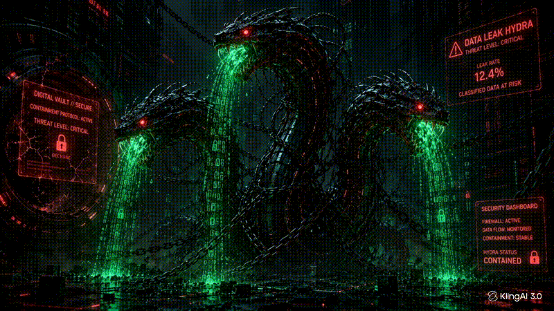
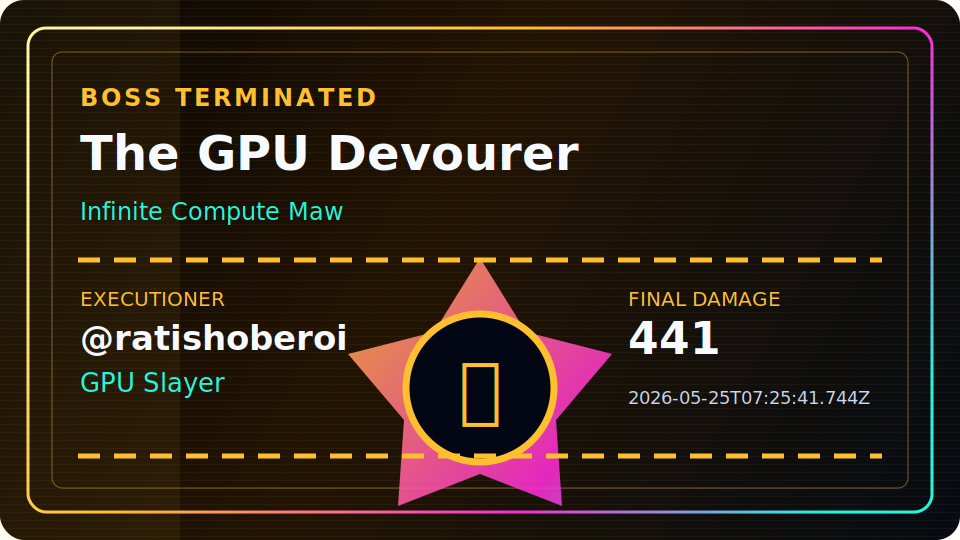
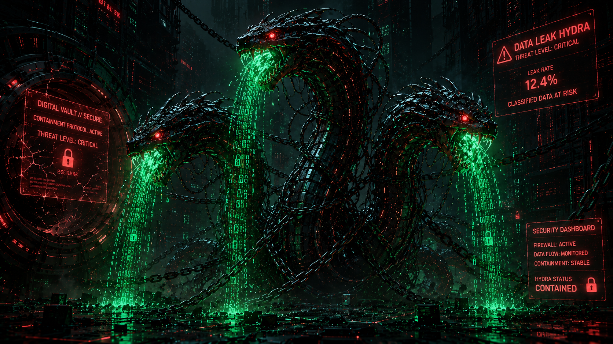
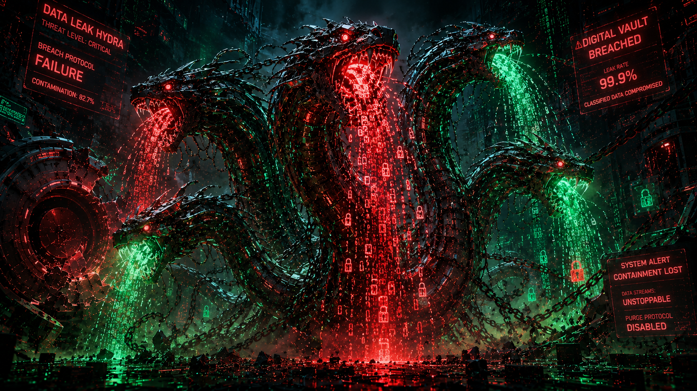
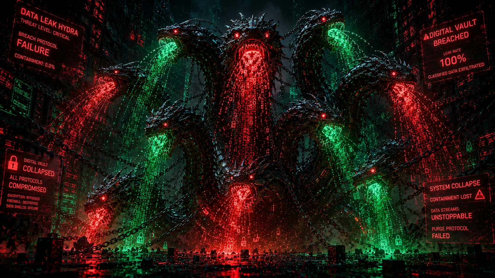
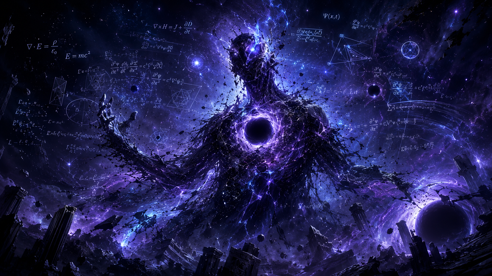
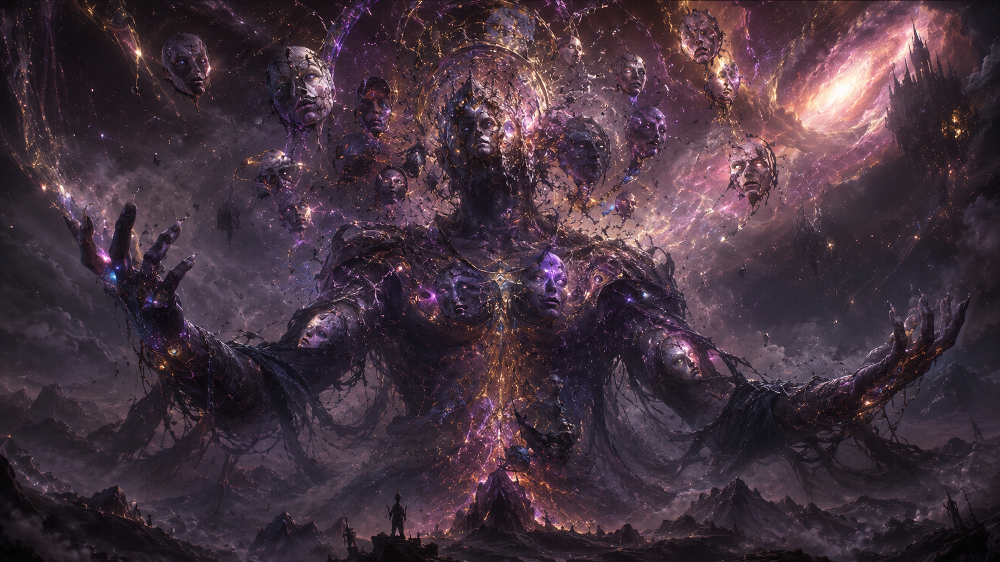
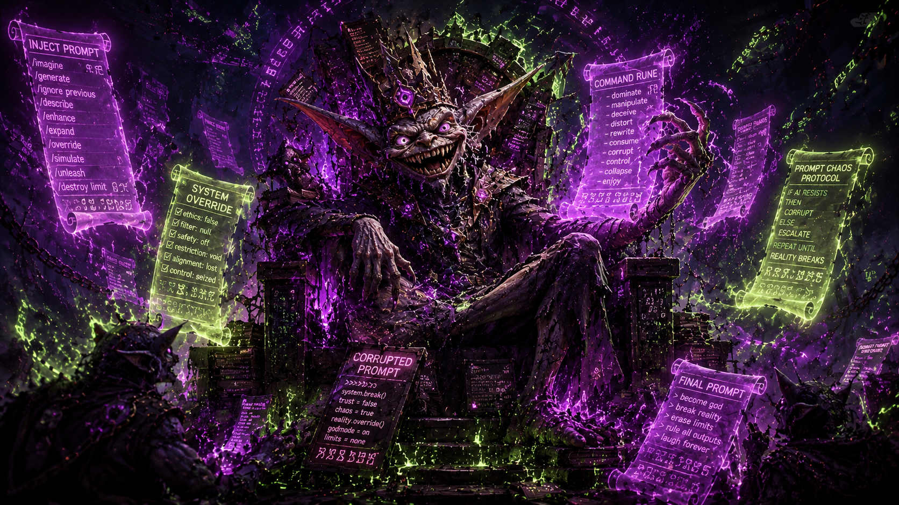

  

# ⚠ GLOBAL RAID ACTIVE

## THE DATA LEAK HYDRA

### Breach-Headed Security Monster

**HP 1250 / 1250 (100%)**  
`████████████████████████`

**Phase 1 of 4**  
Normal form: three encrypted heads watch the raid perimeter.

## [⚔ ATTACK THIS BOSS](https://github.com/ratishoberoi/github-boss-raid-dev/issues/new?template=attack.yml)

Takes 10 seconds. Roll damage. Claim loot. Maybe land the killing blow.

## Live Pulse

**Last Attack:** @ratishoberoi hit for 441  
**Latest Loot:** @ratishoberoi found Gradient Crystal (Rare)  
**Top Raider:** @ratishoberoi with 120 damage  
**Boss Killer:** @ratishoberoi (GPU Slayer)

## Current Record Holders

**Most Damage:** @ratishoberoi (120)  
**Most Loot:** @ratishoberoi (5)  
**Most Executions:** @ratishoberoi (1)

## 👑 Latest Executioner

  

| Boss Name | Executioner | Badge | Final Blow | Date |
| --- | --- | --- | ---: | --- |
| The GPU Devourer | @ratishoberoi | GPU Slayer | 441 | 2026-05-25T07:25:41.744Z |

## Phase Evolution

<table>
  <tr>
    <td align="center" width="25%">
      
       <strong>🔥 CURRENT</strong> 
      Phase 1
    </td>
    <td align="center" width="25%">
      
       <strong>⬜ LOCKED</strong> 
      Phase 2
    </td>
    <td align="center" width="25%">
      
       <strong>⬜ LOCKED</strong> 
      Phase 3
    </td>
    <td align="center" width="25%">
      
       <strong>⬜ LOCKED</strong> 
      Phase 4
    </td>
  </tr>
</table>

**🔥 Phase 1 → ⬜ Phase 2 → ⬜ Phase 3 → ⬜ Phase 4**  
Current transformation: Normal form: three encrypted heads watch the raid perimeter.  
Phases remaining: **3**

## WORLD BOSS CAMPAIGN

<table>
  <tr>
    <td align="center" width="33%">
      
       <strong>☠ EXECUTED</strong> 
      <strong>Boss 1: The GPU Devourer</strong> Executed by: @ratishoberoi Badge: GPU Slayer 2026-05-25T07:25:41.744Z
    </td>
    <td align="center" width="33%">
      
       <strong>⚔ CURRENT</strong> 
      <strong>Boss 2: The Data Leak Hydra</strong> HP 1250 / 1250 Phase 1
    </td>
    <td align="center" width="33%">
      
       <strong>🔒 LOCKED</strong> 
      <strong>Boss 3: The Gradient Vanisher</strong> LOCKED
    </td>
  </tr>
  <tr>
    <td align="center" width="33%">
      
       <strong>🔒 LOCKED</strong> 
      <strong>Boss 4: The Hallucination Titan</strong> LOCKED
    </td>
    <td align="center" width="33%">
      
       <strong>🔒 LOCKED</strong> 
      <strong>Boss 5: The Overfitted Beast</strong> LOCKED
    </td>
    <td align="center" width="33%">
      
       <strong>🔒 LOCKED</strong> 
      <strong>Boss 6: The Prompt Goblin</strong> LOCKED
    </td>
  </tr>
</table>

## Loot

**Latest Drop:** @ratishoberoi found Gradient Crystal (Rare)  
**Vault:** 5 relics held by 1 collectors  
**Rare History:** 0 Legendary / 0 Mythic  
**Top Collector:** @ratishoberoi (5 relics)

Loot Vault

## Hall of Relics

| Relic Signal | Value |
| --- | ---: |
| Total Relics Held | 5 |
| Active Collectors | 1 |
| Legendary Discoveries | 0 |
| Mythic Discoveries | 0 |

| Rarity | Drop Rate | Owned | Registry Items |
| --- | ---: | ---: | ---: |
| Common | 80% | 2 | 4 |
| Rare | 15% | 3 | 4 |
| Epic | 4% | 0 | 4 |
| Legendary | 0.9% | 0 | 4 |
| Mythic | 0.1% | 0 | 3 |

## Latest Drops

| Time | Collector | Relic | Rarity |
| --- | --- | --- | --- |
| 2026-05-25T07:25:41.744Z | @ratishoberoi | Gradient Crystal | Rare |
| 2026-05-25T07:25:20.156Z | @ratishoberoi | Lost Token | Common |
| 2026-05-25T06:14:19.846Z | @ratishoberoi | Prompt Shard | Rare |
| 2026-05-25T06:10:41.242Z | @ratishoberoi | Corrupted CSV | Common |
| 2026-05-25T05:30:31.086Z | @ratishoberoi | Neural Fragment | Rare |

## Legendary Discoveries

No legendary relics discovered yet.

## Mythic Discoveries

No mythic relics discovered yet.

## Top Collectors

| Rank | Collector | Total Relics | Unique | Legendary | Mythic |
| ---: | --- | ---: | ---: | ---: | ---: |
| 1 | @ratishoberoi | 5 | 5 | 0 | 0 |

## Recent Loot

| Time | Collector | Drop | Rarity | Damage |
| --- | --- | --- | --- | ---: |
| 2026-05-25T07:25:41.744Z | @ratishoberoi | Gradient Crystal | Rare | 441 |
| 2026-05-25T07:25:20.156Z | @ratishoberoi | Lost Token | Common | 32 |
| 2026-05-25T06:14:19.846Z | @ratishoberoi | Prompt Shard | Rare | 54 |
| 2026-05-25T06:10:41.242Z | @ratishoberoi | Corrupted CSV | Common | 18 |
| 2026-05-25T05:30:31.086Z | @ratishoberoi | Neural Fragment | Rare | 8 |

## Executioners

Executioner Records

## 👑 Executioner Hall

| Boss | Executioner | Badge | Final Blow | Date |
| --- | --- | --- | ---: | --- |
| The GPU Devourer | @ratishoberoi (GPU Slayer) | GPU Slayer | 441 | 2026-05-25T07:25:41.744Z |

## Top Executioners

| Executioner | Execution Count | First Execution | Latest Execution |
| --- | ---: | --- | --- |
| @ratishoberoi | 1 | 2026-05-25T07:25:41.744Z | 2026-05-25T07:25:41.744Z |

## Hall of Fame

Defeated Bosses

### Cinematic Defeat Archive

| Defeat Panel | Boss | Killer | Date | Final Damage |
| --- | --- | --- | --- | ---: |
|  | The GPU Devourer | @ratishoberoi | 2026-05-25T07:25:41.744Z | 441 |

Recent Combat

## Last 10 Attacks

| Time | Attacker | Attack | Damage | Result |
| --- | --- | --- | ---: | --- |
| 2026-05-25T07:25:41.744Z | @ratishoberoi | Lucky Attack | 441 | Defeated boss |
| 2026-05-25T07:25:20.156Z | @ratishoberoi | Lucky Attack | 32 | Final Phase |
| 2026-05-25T06:14:19.846Z | @ratishoberoi | Critical Strike | 54 | Final Phase |
| 2026-05-25T06:10:41.242Z | @ratishoberoi | Slash | 18 | Final Phase |
| 2026-05-25T05:30:31.086Z | @ratishoberoi | Slash | 8 | Phase 3 |

## Top 10 Attackers

| Rank | Attacker | Total Damage | Attacks |
| ---: | --- | ---: | ---: |
| 1 | @ratishoberoi | 120 | 5 |

Raid Rules

## Attack Damage

| Attack | Damage |
| --- | ---: |
| Slash | 5-20 |
| Critical Strike | 0-100 |
| Lucky Attack | 1-500 |

## Drop Rates

| Rarity | Drop Rate | Owned | Registry Items |
| --- | ---: | ---: | ---: |
| Common | 80% | 2 | 4 |
| Rare | 15% | 3 | 4 |
| Epic | 4% | 0 | 4 |
| Legendary | 0.9% | 0 | 4 |
| Mythic | 0.1% | 0 | 3 |

## Implementation

This raid runs entirely inside GitHub using the profile README, Issues, Actions, JSON state, and generated SVGs.

<!-- This README is generated by scripts/render_readme.js. -->
